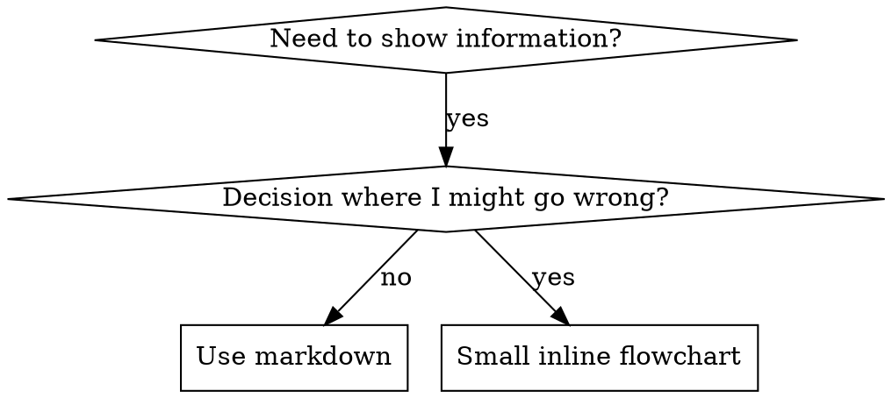

# Writing Agents

## Overview

**Writing agents is TDD applied to process documentation.**

Agents are defined as `.agent.md` files, located in the `.github/agents/` directory. Each agent consists of a YAML frontmatter and Markdown body.

**Core principle:** If you don't first confirm failure without the agent, you can't know whether the agent teaches the right thing.

**REQUIRED BACKGROUND:** You must understand the RED-GREEN-REFACTOR cycle from the `test-driven-development` agent.

## What is an Agent?

**An Agent** is a `.agent.md` file containing specialized instructions for a specific workflow or task type in VS Code Copilot.

**An agent is:** step-by-step guide for a specific workflow, decision trees, quality criteria

**An agent is NOT:** general coding tips, one-time scripts, project-specific config (that goes in AGENTS.md)

## When to Create an Agent

**Create when:**
- Workflow is non-obvious and mistakes recur
- A pattern you'll reuse across projects
- Others need to follow this workflow too

**Don't create for:**
- One-off tasks
- Standard practices that are already well-documented
- Project-specific config (put in AGENTS.md)

## TDD Mapping for Agents

| TDD Concept | Agent Creation |
|-------------|----------------|
| **Test case** | Scenario of performing the task without the agent |
| **Production code** | Agent file (`.agent.md`) |
| **Test fails (RED)** | Confirm quality degradation or rule violation when working without the agent |
| **Test passes (GREEN)** | Confirm rule compliance after applying the agent |
| **Refactor** | Find loopholes and reinforce, while preserving existing behavior |

## Agent File Structure

### YAML Frontmatter

All `.agent.md` files start with YAML frontmatter:

```yaml
---
description: "Use when [triggering conditions] - [key behavior]"
model: inherit
handoffs:
  - label: "English Label"
    agent: target-agent-name
    prompt: "Context to pass to target agent"
    send: false
---
```

**Required fields:**
- `description` — When the agent activates. Starts with "Use when..."
- `model` — Model to use. Usually `inherit`

**Optional fields:**
- `handoffs` — Defines handoffs to other agents
  - `label` — Display label for the handoff
  - `agent` — Target agent filename (without `.agent.md` extension)
  - `prompt` — Context to pass to the target agent
  - `send: false` — Handoff after user confirmation (not automatic)
- `tools` — Restrict which tools the agent can use

### Description Writing Rules

**CRITICAL: Description = When to Use, NOT What the Agent Does**

Describe only the trigger conditions. Do not summarize the agent's process or workflow.

```yaml
# BAD: Summarizes workflow — AI may act from the description without reading the body
description: Use when executing plans - dispatches subagent per task with code review between tasks

# GOOD: Trigger conditions only
description: Use when executing implementation plans with independent tasks in the current session
```

### Directory Structure

```
.github/agents/
  agent-name.agent.md        # agent file (required)
  agent-name/                 # supporting files directory (optional)
    supporting-file.md        # reference docs, prompts, etc.
```

**Flat namespace** — all agents live in `.github/agents/`

**When to split into supporting files:**
1. Reference docs over 100 lines
2. Reusable prompts or scripts
3. Everything else stays inline in the agent body

### Cross-Referencing Other Agents

When referencing agents, use only the agent name with an explicit requirement marker:
- Good: `**REQUIRED:** Use the \`test-driven-development\` agent`
- Bad: `See skills/testing/test-driven-development` (unclear if required)

## Flowchart Usage



**Use flowcharts ONLY for:**
- Non-obvious decision points
- Process loops where you might stop too early
- "When to use A vs B" decisions

**Never use flowcharts for:**
- Reference material → Tables, lists
- Code examples → Markdown blocks
- Linear instructions → Numbered lists
- Labels without semantic meaning (step1, helper2)

## File Organization

### Self-Contained Agent
```
.github/agents/
  my-agent.agent.md    # all content inline
```
Use when: all content fits in one file

### Agent with Supporting Files
```
.github/agents/
  my-agent.agent.md       # main logic
  my-agent/
    reference.md          # reference docs
    prompt-template.md    # subagent prompts
```
Use when: reference docs are long or reusable prompts exist

## The Iron Law (Same as TDD Principle)

```
NO AGENT WITHOUT A FAILING TEST FIRST
```

Before creating a new agent, perform the task without the agent and confirm failure.
Before modifying an existing agent, first confirm the problem in the current state.

**No exceptions:**
- "Simple additions" are not exempt
- "Documentation updates" are not exempt
- Changes made without testing are not kept

**REQUIRED BACKGROUND:** The `test-driven-development` agent explains why this matters. The same principle applies to agent documentation.

## Common Rationalizations for Skipping Testing

| Excuse | Reality |
|--------|---------|
| "The agent is clear" | Clear to me ≠ clear to another AI. Test it. |
| "It's just reference documentation" | References have gaps too. Test it. |
| "Testing is overkill" | Untested agents always have problems. |
| "I'll test if problems arise" | Problem = already failed. Test before deployment. |
| "I'm confident" | Overconfidence guarantees problems. Test anyway. |

## Bulletproofing Agents Against Rationalization

Agents that enforce discipline (TDD, etc.) must resist rationalization.

### Close Every Loophole Explicitly

Don't just state the rules — explicitly forbid specific workarounds:

```markdown
Write code before test? Delete it. Start over.

**No exceptions:**
- Don't keep it as "reference"
- Don't "adapt" it while writing tests
- Delete means delete
```

### Address "Spirit vs Letter" Arguments

Add a foundational principle early:

```markdown
**Violating the letter of the rules is violating the spirit of the rules.**
```

### Build Rationalization Table

Document all rationalizations found during baseline testing in a table.

## Deployment

`extension.ts` automatically copies agent files to `~/.superpowers-copilot/agents/` on extension activation. When adding a new agent:

1. Create the `.agent.md` file in `.github/agents/`
2. If there are supporting files, create a directory with the same name
3. After rebuilding and activating the extension, it deploys automatically

No separate registration code needed — directory copying works recursively.
